<div align="center">

<picture>
  <source media="(prefers-color-scheme: light)" srcset="docs/readme/hero-light.webp">
  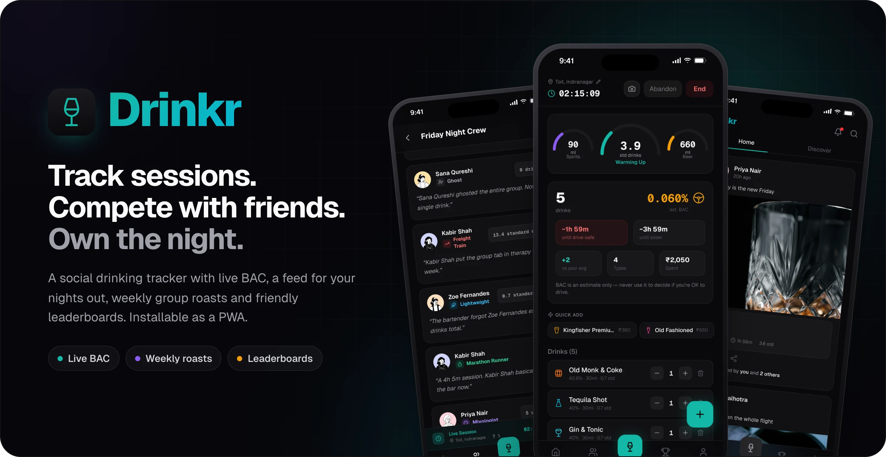
</picture>

<br>
<br>

[](https://github.com/darahaas15/hevydrinkr/actions/workflows/ci.yml)


**Hevy, but for your nights out.**
Log every drink in a tap, watch a live BAC estimate, post the night to your friends,<br>
and let the app hand your group a brutally honest roast every week.

<a href="https://hevydrinkr.com"></a>

<sub>Built for your phone: open it there and add it to your home screen.</sub>

[Tour](#tour) · [Features](#features) · [Weekly roasts](#weekly-roasts) · [How it works](#how-it-works) · [Under the hood](#under-the-hood) · [Run it](#run-it-locally)

</div>

---

## Tour

Log the night, share it, compete over it, look back on it.
Every screen below is a real capture of the app, seeded with a fictional group of friends.

### Live session

<picture>
  <source media="(prefers-color-scheme: light)" srcset="docs/readme/tour-session-light.webp">
  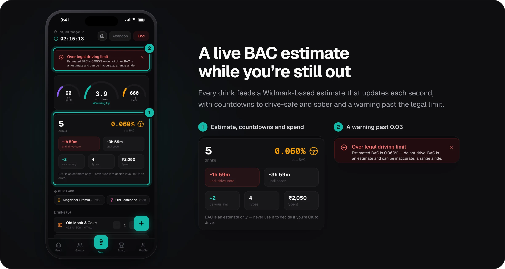
</picture>

### Drink picker

<picture>
  <source media="(prefers-color-scheme: light)" srcset="docs/readme/tour-picker-light.webp">
  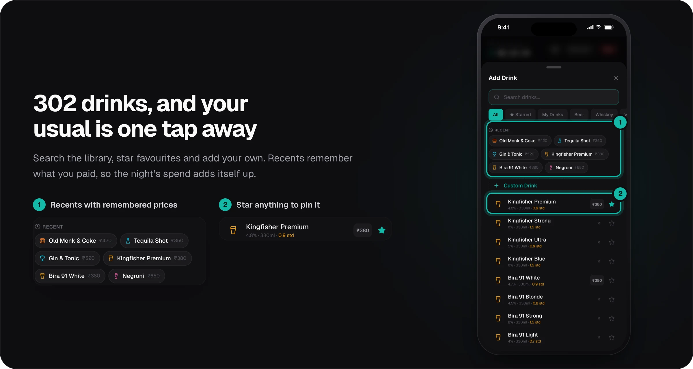
</picture>

### Social feed

<picture>
  <source media="(prefers-color-scheme: light)" srcset="docs/readme/tour-feed-light.webp">
  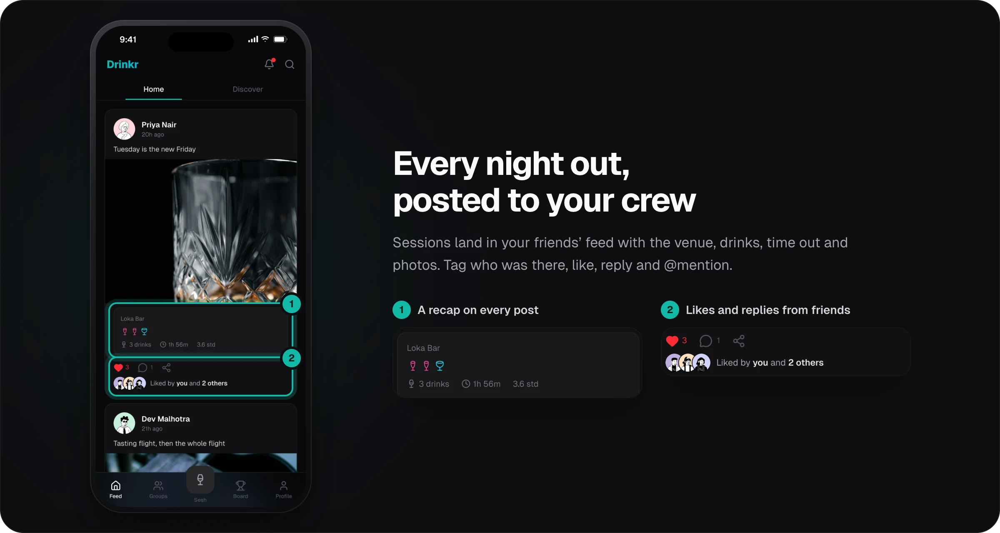
</picture>

### Post detail

<picture>
  <source media="(prefers-color-scheme: light)" srcset="docs/readme/tour-post-light.webp">
  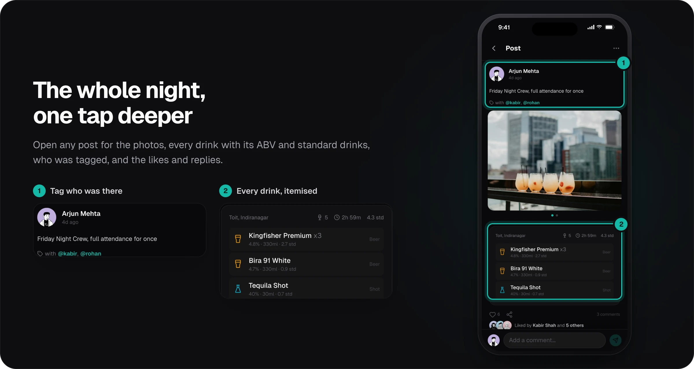
</picture>

### Leaderboard

<picture>
  <source media="(prefers-color-scheme: light)" srcset="docs/readme/tour-leaderboard-light.webp">
  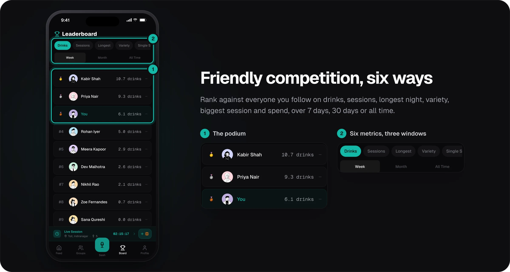
</picture>

### Weekly roast

<picture>
  <source media="(prefers-color-scheme: light)" srcset="docs/readme/tour-roast-light.webp">
  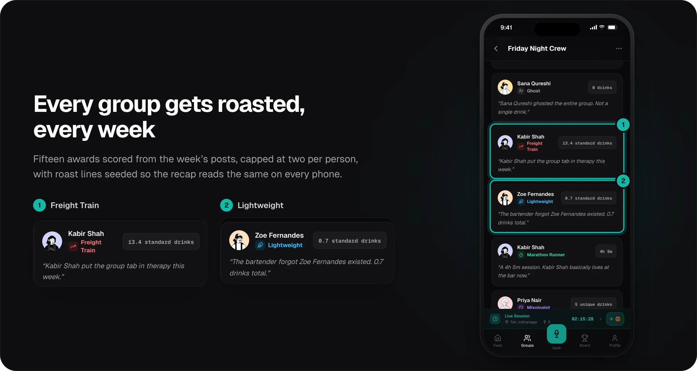
</picture>

### Groups

<picture>
  <source media="(prefers-color-scheme: light)" srcset="docs/readme/tour-groups-light.webp">
  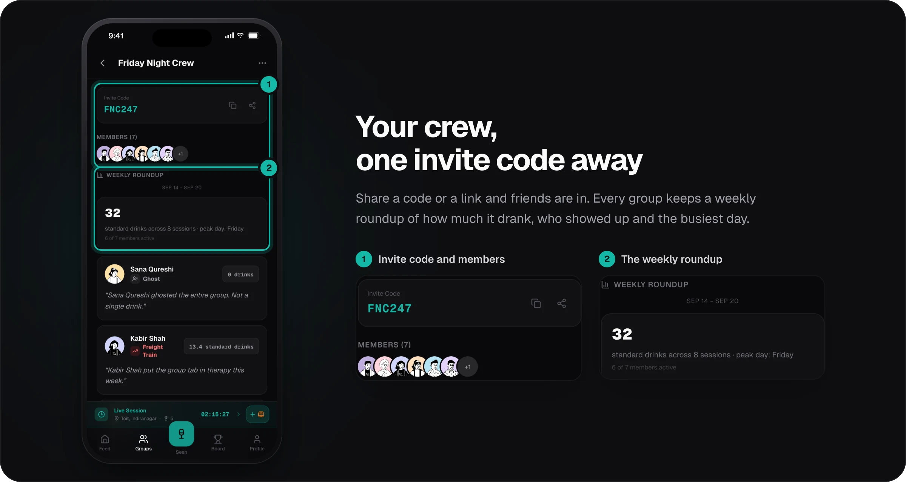
</picture>

### Profile

<picture>
  <source media="(prefers-color-scheme: light)" srcset="docs/readme/tour-profile-light.webp">
  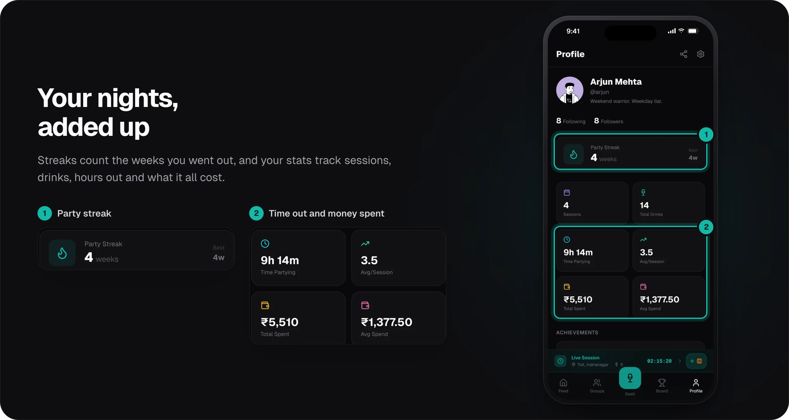
</picture>

### Highlights

<picture>
  <source media="(prefers-color-scheme: light)" srcset="docs/readme/tour-highlights-light.webp">
  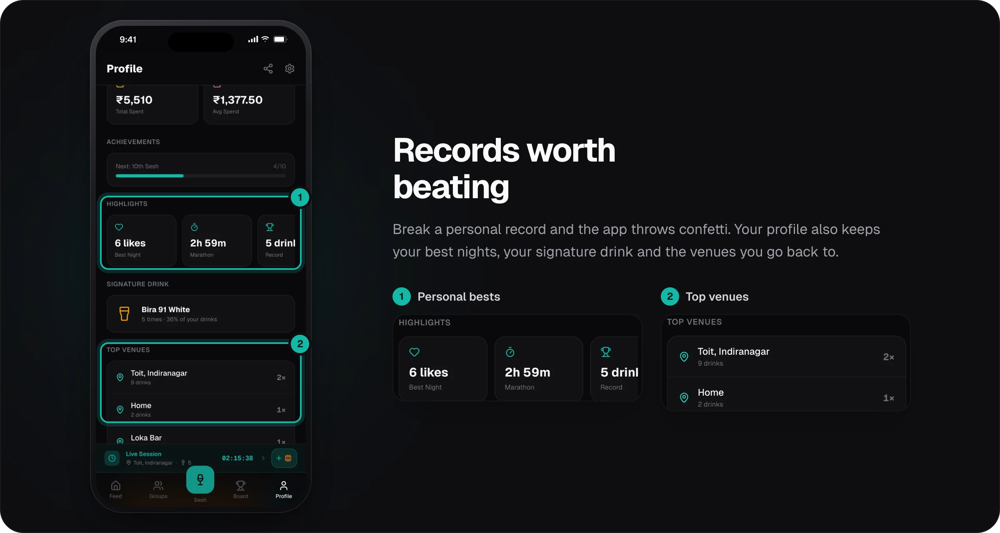
</picture>

<sub>Avatars are <a href="https://www.dicebear.com/styles/notionists/">DiceBear Notionists</a> (CC0) and photos are from <a href="https://unsplash.com/license">Unsplash</a>.</sub>

## Features

The tour covers the highlights; this is the full list.

### Log a night in seconds

- **Live sessions** with a running timer, venue, photos, and a drink cart with `+` / `-` controls and undo on delete.
- **Quick Add** puts your starred and most recent drinks one tap away, and the live-session bar can re-log your last drink from any screen.
- **302 drinks across 13 categories**, heavy on the Indian bar menu (Kingfisher, Bira 91, Old Monk, Sula, the desi classics), plus your own custom drinks.
- **Spend tracking**: price a drink once and it is remembered, in INR, USD, EUR, GBP, AUD or SGD.
- **Past sessions** can be logged after the fact, and a live session can be saved without posting and shared later.
- **Venue autocomplete** learns from your own history and folds "toit" and "Toit" into one place.

### A live BAC estimate, with guardrails

- A Widmark-based estimate recalculated every second while you drink, with the session's peak saved.
- Countdowns to "drive-safe" and "sober", plus a warning once you pass 0.03, India's legal driving limit.
- The live BAC card always carries a reminder that it is an estimate, never a reason to drive.

### Social by default

- A **feed** of your friends' nights with photo carousels, tagged friends, likes, comment replies, comment likes and @mentions.
- A **Discover** tab with user search and suggested people.
- **Realtime**: new posts, likes and comments stream in without a refresh.
- **Private accounts** with follow requests, plus blocking and reporting.
- **Web push notifications** for likes, comments and replies, @mentions, tags, follows, friends' new posts and a check-in on long sessions, with per-category switches in Settings.

### Compete with your crew

- **Leaderboards** rank you against everyone you follow on drinks, sessions, longest session, variety, biggest single session and spend, over the last 7 days, 30 days or all time.
- **Groups** with shareable invite codes and links, a weekly roundup, award streaks and all-time group records.
- **Personal records** (most drinks, highest drink score, longest session, most variety, fastest back-to-back) trigger a confetti celebration.
- **Party streaks** count consecutive weeks out, and milestone badges mark your 10th, 25th, 50th and 100th session.

### Feels like a native app

- Installable **PWA** with an install guide for iOS and Android, an offline fallback page and an in-app "new version" prompt.
- **Light or dark** theme (dark by default), painted before the first frame so there is no flash on launch.
- Haptic feedback where the platform supports it.

<p align="center">
  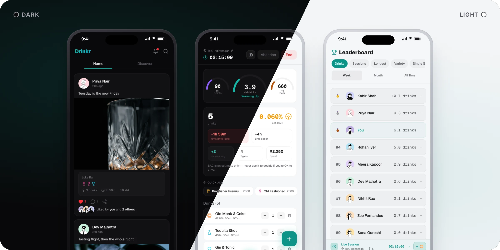
</p>

## Weekly roasts

Every group of two or more gets a roast of the previous week the first time a member opens it.
The engine scores each member's posted sessions and hands out up to 15 awards, capped at two per person so nobody hogs the spotlight.

| Award | Goes to |
|---|---|
| 🚂 **Freight Train** | Most standard drinks in the week |
| 🪶 **Lightweight** | Fewest standard drinks among members who drank |
| 👻 **Ghost** | A member with zero sessions |
| 💨 **Sprinter** | Biggest single session (4+ standard drinks) |
| 🏃 **Marathon Runner** | Longest single session (60+ minutes) |
| 🍸 **Mixologist** | Most different drinks (4+) |
| 🐴 **One Trick Pony** | Two or fewer different drinks across 3+ drinks |
| 🔒 **Category Locked** | Every drink from a single category |
| 🦋 **Social Butterfly** | Most sessions (3+) |
| 💼 **Weekday Warrior** | Three or more weekday sessions, outnumbering the weekend |
| 🌅 **Early Bird** | Earliest post time of day, before 2 PM |
| 🦉 **Night Owl** | Latest post time of day, 11 PM or later |
| 🕐 **Broken Clock** | Earliest weekday post, before 2 PM |
| ⛷️ **Snowball** | Drank more each day, three or more days running |
| ☄️ **All or Nothing** | A single session all week, with 5+ standard drinks |

Each award has five roast lines.
The line is picked by hashing `week:user:award`, so a recap reads the same on every phone and on every refresh.
If two phones generate the same week at once, the database's unique constraint lets one win and the other loads the saved copy.

## How it works

### Standard drinks

```text
standard drinks = volume (ml) × ABV (%) / 100 × 0.789 g/ml ÷ 14 g
```

`0.789` is the density of ethanol and `14 g` is one US standard drink.
A 330 ml Kingfisher Premium at 4.8% is 0.9 standard drinks; a 30 ml tequila shot at 40% is 0.7.

### BAC

Each drink contributes its full Widmark value, `alcohol (g) ÷ (body weight (g) × r) × 100`, ramped in linearly over 30 minutes.
The distribution ratio `r` is 0.68 for men, 0.55 for women and 0.615 otherwise.
The body clears a constant 0.015 per hour from the first drink onward, and the estimate never drops below zero.

<picture>
  <source media="(prefers-color-scheme: light)" srcset="docs/readme/bac-curve-light.png">
  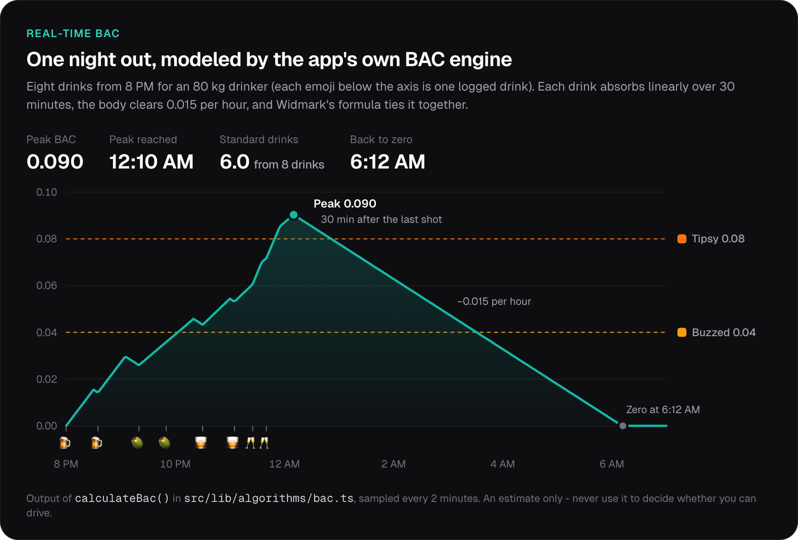
</picture>

The chart above is the literal output of `calculateBac()` in [`src/lib/algorithms/bac.ts`](src/lib/algorithms/bac.ts), sampled every two minutes.

## Under the hood

<picture>
  <source media="(prefers-color-scheme: light)" srcset="docs/readme/architecture-light.webp">
  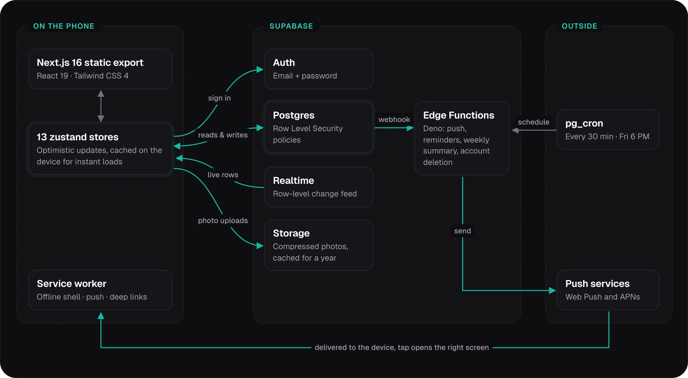
</picture>

- **No app server.** The app is a static export; every read and write goes straight to Supabase through Row Level Security, and dynamic routes like `/feed/:id` are served by Vercel rewrites to prebuilt pages.
- **Realtime patches, not refetches.** Feed changes arrive as per-row payloads that patch local state, so an optimistic like is never clobbered, and a dropped channel resubscribes on its own.
- **Push without a push library.** The `send-notification` edge function encrypts Web Push payloads with WebCrypto, honours each user's preferences, prunes dead subscriptions and also speaks APNs.
- **Scheduled nudges.** `session-reminder` runs every 30 minutes to check on sessions still going after two hours, and `weekly-summary` sends a week in review every Friday at 6 PM.
- **Survives schema drift.** Additive columns are optional: if a deploy lands before its migration, the query retries once without the column and only that feature switches off ([`optional-columns.ts`](src/lib/supabase/optional-columns.ts)).
- **Light on bandwidth.** Photos are compressed on the device to 100 KB at 800 px (avatars to 50 KB at 200 px) and cached for a year; the changelog ships in the bundle instead of the database.
- **Right data in the right place.** Accounts, sessions and social data live in Postgres; starred drinks, recents, prices and theme stay on the device for instant reads.
- **Locked down.** Row Level Security on every table keeps private accounts private and group data members-only, and scheduled functions only answer the scheduler. The site ships a strict Content Security Policy, HSTS and `frame-ancestors 'none'`, and account deletion resolves the user from their token, never the request body.

### Tech stack

| Layer | Tech |
|---|---|
| Framework | Next.js 16 (App Router, static export), React 19, TypeScript |
| Styling & motion | Tailwind CSS 4 (CSS-first tokens), Framer Motion, Geist |
| State | zustand with `persist` |
| Backend | Supabase: Postgres + RLS, Auth, Realtime, Storage, Edge Functions (Deno), pg_cron |
| PWA | Service worker, Web App Manifest, Web Push |
| Icons | Tabler Icons, Lucide |
| Testing & CI | Vitest with V8 coverage, GitHub Actions |

### Project structure

```text
src/
├── app/                   App Router routes, exported as static pages
│   └── (app)/             Signed-in shell: feed, session, groups, leaderboard, profile
├── components/            UI primitives plus session, feed and theme components
├── stores/                zustand stores (auth, session, feed, groups, roast, ...)
└── lib/
    ├── algorithms/        BAC, leaderboard, personal records, streaks, roast engine
    ├── data/              The 302-drink library
    └── supabase/          Client and optional-column helpers
supabase/
├── functions/             Edge functions: push, reminders, weekly summary, account deletion
└── migrations/            Incremental SQL migrations
tests/
├── contract/              Snapshot of the tables and columns the frontend touches
└── integration/           Contract and RLS tests against a local Supabase
public/sw.js               Service worker
```

## Run it locally

You need Node 20 and a Supabase project.

```bash
git clone https://github.com/darahaas15/hevydrinkr.git
cd hevydrinkr
npm install
```

Create `.env.local`:

```bash
NEXT_PUBLIC_SUPABASE_URL=https://<project>.supabase.co
NEXT_PUBLIC_SUPABASE_ANON_KEY=<anon key>
NEXT_PUBLIC_SITE_URL=http://localhost:3000   # used for password-reset links
NEXT_PUBLIC_VAPID_PUBLIC_KEY=<optional>      # enables web push
```

```bash
npm run dev
```

Outside of `localhost` the app asks to be installed to the home screen first, just like the production PWA.

> [!NOTE]
> The migration history is being consolidated into a single baseline.
> Until that lands, `supabase/schema.sql` plus the ordered file list in [`scripts/test-db-bootstrap.sh`](scripts/test-db-bootstrap.sh) is the reference for building the schema from scratch.

### Scripts

| Command | What it does |
|---|---|
| `npm run dev` | Start the dev server |
| `npm run build` | Static export to `out/` |
| `npm run ci` | Typecheck and run the test suite |
| `npm run lint` | ESLint (CI fails on errors) |
| `npm run test:coverage` | Tests with a coverage report for the domain layer |
| `npm run contract:update` | Refresh the frontend-to-database contract snapshot |
| `npm run test:rls` | Contract and RLS tests against a local Supabase |
| `npm run lint:colors` | Report hardcoded colors that should use theme tokens |

## Testing

- **165 tests** run on every pull request and push to `main`, alongside a strict TypeScript check and ESLint.
- The domain layer (BAC, leaderboards, personal records, streaks, roast engine, money, venues) is unit-tested with a pinned UTC timezone so date math is deterministic.
- A **database contract test** scans the frontend for the tables, columns and RPCs it touches and fails if that surface changes without an updated snapshot.
- An **RLS suite** signs in as real users against a local Supabase and refuses to run against anything that isn't local.

## Drink responsibly

Drinkr is for adults 18 and over.
Its BAC figures are estimates that ignore food, hydration, medication and individual metabolism; never use them to decide whether you can drive.
If drinking is becoming a problem, SAMHSA's free, confidential helpline is 1-800-662-4357.

<br>

<div align="center">
<sub>Built by <a href="https://github.com/darahaas15">@darahaas15</a> with Next.js and Supabase. Not affiliated with Hevy.</sub>
</div>
